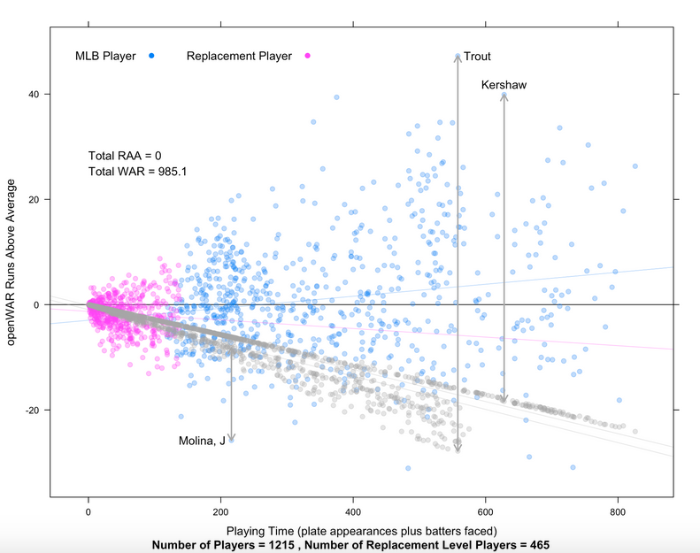
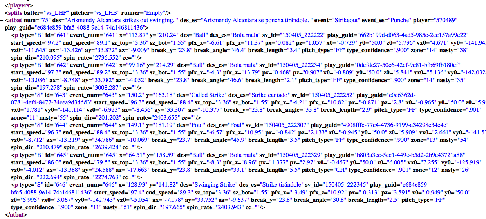

## Recap

### Introduction to Baseball Analytics

- [BUx edX | Sabermetrics 101](https://www.edx.org/course/sabermetrics-101-introduction-baseball-bux-sabr101x-0)

### Useful R packages

- [Lahman Database](http://lahman.r-forge.r-project.org/)
- [pitchRx](http://cpsievert.github.io/pitchRx/#2D_animation)
- [openWAR](https://baseballwithr.wordpress.com/2014/03/17/introduction-to-openwar/)
- [RSelenium](http://ropensci.github.io/RSelenium/)
- [phantomJS](http://phantomjs.org/)

---

## Sabermetrics

### Pythagorean theorem

$$latex
\frac{RS^2}{RS^2 + RA^2} = \text{Est. Winning Percentage} \text{, where RS = Runs Scored, RA = Runs Allowed}
$$
$$latex
\text{i.e., Est. Winning Percentage} = \frac{R^n}{R^n + 1} \text{, where } R = \frac{RS}{RA} \text{as the scoring ratio}
$$

```{r, echo=FALSE, fig.width=12, fig.height=4}
library(ggplot2)
pythfun <- function(r ,n){
  return ((r^n)/(r^n + 1))
}
rr <- c(0, 0.1, 0.2, 0.3, 0.4, 0.5, 0.6, 0.7, 0.8, 0.9, 1.0, 1.1, 1.2, 1.3, 1.4, 1.5, 1.6)
ggplot() + 
  geom_line(aes(x = rr, y = pythfun(rr, 1)), color = 'red') + 
  geom_line(aes(x = rr, y = pythfun(rr, 2)), color = 'blue') + 
  geom_line(aes(x = rr, y = pythfun(rr, 20)), color = 'black') + 
  xlab("Scoring ratio") + ylab("Winning percentage") + coord_fixed()
```

---

## Sabermetrics

### Runs Created formula
- From common sense to a linear weighted model

---

## Sabermetrics

### Win Above Replacement

[openWAR](https://baseballwithr.wordpress.com/category/openwar/)



---

## openWAR

```{r}
require(openWAR)
source("~/Documents/openWAR/R/GameDay.R")
getGameIds(date=as.Date("2015-04-05"))
gd = gameday(gameId="gid_2015_04_05_slnmlb_chnmlb_1")
```

---

## openWAR

```{r}
gd$url
```

---

## openWAR



---

## openWAR

```{r}
str(gd$ds)
```

---

## openWAR

```{r, fig.width=12, fig.height=6, warning=FALSE}
ggplot(data = gd$ds, aes(x = x, y = y, color = isHit)) + geom_point(size = 3) + coord_fixed()
```

---

## Data Source

- Lahman database (A classic default sample data)
- MLBAM: Gameday (Real-time request)
- Official website (Crawler)

---

## CPBL

```{r}
load("hr_tables.RData")
tail(hr_tables[[26]])
```

---

## Early Power Surge: is that real?

```{r}
filter(hr_tables[[22]], DATE == "2011/4/21")
filter(hr_tables[[23]], DATE == "2012/4/20")
filter(hr_tables[[24]], DATE == "2013/4/20")
filter(hr_tables[[25]], DATE == "2014/4/22")
filter(hr_tables[[26]], DATE == "2015/4/19")
```

---

## Early Power Surge: is that real?
