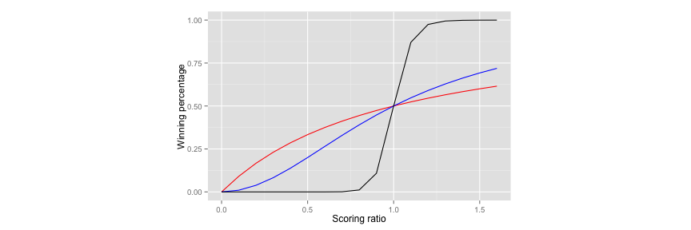
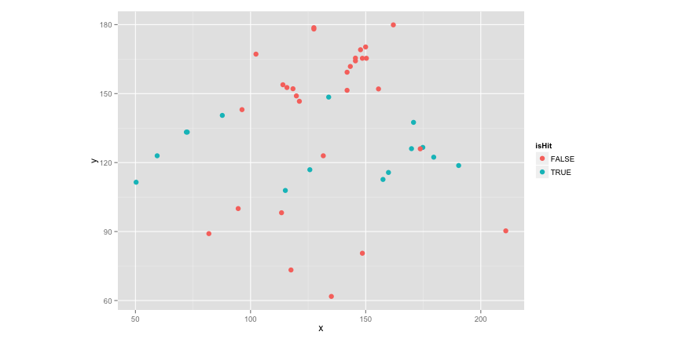

## Recap

### Introduction to Baseball Analytics

> - [BUx edX | Sabermetrics 101](https://www.edx.org/course/sabermetrics-101-introduction-baseball-bux-sabr101x-0)

### Useful R packages

> - [Lahman Database](http://lahman.r-forge.r-project.org/)
> - [pitchRx](http://cpsievert.github.io/pitchRx/#2D_animation)
> - [openWAR](https://baseballwithr.wordpress.com/2014/03/17/introduction-to-openwar/)
> - [RSelenium](http://ropensci.github.io/RSelenium/)
> - [phantomJS](http://phantomjs.org/)

---

## Sabermetrics

### Pythagorean theorem

$$latex
\frac{RS^2}{RS^2 + RA^2} = \text{Est. Winning Percentage} \text{, where RS = Runs Scored, RA = Runs Allowed}
$$
$$latex
\text{i.e., Est. Winning Percentage} = \frac{R^n}{R^n + 1} \text{, where } R = \frac{RS}{RA} \text{as the scoring ratio}
$$

 

---

## Sabermetrics

### Runs Created formula

- From common sense

$$latex
TB = Singles + 2\times Doubles(2B) + 3\times Triples(3B) + 4\times HR
$$

- To a linear weighted model

$$latex
\text{ Predicted runs = constant + B1(BB + HBP) }\\
\text{ + B2(singles) + B3(2B) + B4(3B) }\\
\text{ + B5(HR) + B6(SB) + B7(CS) }\\
$$

---

## Sabermetrics

### Win Above Replacement

[openWAR](https://baseballwithr.wordpress.com/category/openwar/)


---

## openWAR


```r
require(openWAR)
source("~/Documents/openWAR/R/GameDay.R")
getGameIds(date=as.Date("2015-04-05"))
```

```
## 
## Retrieving data from 2015-04-05 ...
## ...found 2 games
```

```
## [1] "gid_2015_04_05_slnmlb_chnmlb_1" "gid_2015_04_05_zznmlb_zzamlb_1"
```

```r
gd = gameday(gameId="gid_2015_04_05_slnmlb_chnmlb_1")
```

```
## gid_2015_04_05_slnmlb_chnmlb_1
```

---

## openWAR


```r
gd$url
```

```
##                                                                                                        bis_boxscore.xml 
##      "http://gd2.mlb.com/components/game/mlb/year_2015/month_04/day_05/gid_2015_04_05_slnmlb_chnmlb_1/bis_boxscore.xml" 
##                                                                                                          inning_all.xml 
## "http://gd2.mlb.com/components/game/mlb/year_2015/month_04/day_05/gid_2015_04_05_slnmlb_chnmlb_1/inning/inning_all.xml" 
##                                                                                                          inning_hit.xml 
## "http://gd2.mlb.com/components/game/mlb/year_2015/month_04/day_05/gid_2015_04_05_slnmlb_chnmlb_1/inning/inning_hit.xml" 
##                                                                                                                game.xml 
##              "http://gd2.mlb.com/components/game/mlb/year_2015/month_04/day_05/gid_2015_04_05_slnmlb_chnmlb_1/game.xml" 
##                                                                                                         game_events.xml 
##       "http://gd2.mlb.com/components/game/mlb/year_2015/month_04/day_05/gid_2015_04_05_slnmlb_chnmlb_1/game_events.xml"
```

---

## openWAR


---

## openWAR


```r
str(gd$ds)
```

```
## 'data.frame':	75 obs. of  62 variables:
##  $ pitcherId     : num  452657 452657 452657 452657 452657 ...
##  $ batterId      : num  572761 518792 407812 425509 571431 ...
##  $ field_teamId  : chr  "112" "112" "112" "112" ...
##  $ ab_num        : num  1 2 3 4 5 6 7 8 9 10 ...
##  $ inning        : num  1 1 1 1 1 1 1 1 1 2 ...
##  $ half          : Factor w/ 2 levels "bottom","top": 2 2 2 2 2 1 1 1 1 2 ...
##  $ balls         : num  2 1 2 0 1 1 1 2 2 1 ...
##  $ strikes       : num  2 0 0 3 3 0 2 3 1 3 ...
##  $ endOuts       : num  1 1 1 2 3 0 1 2 3 1 ...
##  $ event         : Factor w/ 18 levels "Caught Stealing 2B",..: 7 3 15 17 17 3 7 17 7 17 ...
##  $ actionId      : num  NA NA NA NA NA NA NA NA NA NA ...
##  $ description   : Factor w/ 94 levels "Adam Wainwright called out on strikes.  ",..: 51 23 55 32 49 20 39 4 79 93 ...
##  $ stand         : Factor w/ 2 levels "L","R": 1 1 2 2 1 1 2 1 2 2 ...
##  $ throws        : Factor w/ 2 levels "L","R": 1 1 1 1 1 2 2 2 2 1 ...
##  $ runnerMovement: Factor w/ 45 levels "","[407812::1B::Walk]",..: 1 26 28 1 3 17 18 1 19 1 ...
##  $ x             : num  142 190 175 NA NA ...
##  $ y             : num  159 119 127 NA NA ...
##  $ game_type     : Factor w/ 1 level "R": 1 1 1 1 1 1 1 1 1 1 ...
##  $ home_team     : Factor w/ 1 level "chn": 1 1 1 1 1 1 1 1 1 1 ...
##  $ home_teamId   : num  112 112 112 112 112 112 112 112 112 112 ...
##  $ home_lg       : Factor w/ 1 level "NL": 1 1 1 1 1 1 1 1 1 1 ...
##  $ away_team     : Factor w/ 1 level "sln": 1 1 1 1 1 1 1 1 1 1 ...
##  $ away_teamId   : num  138 138 138 138 138 138 138 138 138 138 ...
##  $ away_lg       : Factor w/ 1 level "NL": 1 1 1 1 1 1 1 1 1 1 ...
##  $ venueId       : num  17 17 17 17 17 17 17 17 17 17 ...
##  $ stadium       : Factor w/ 1 level "Wrigley Field": 1 1 1 1 1 1 1 1 1 1 ...
##  $ timestamp     : chr  "2015-04-06 00:16:58" "2015-04-06 00:19:47" "2015-04-06 00:18:55" "2015-04-06 00:20:42" ...
##  $ playerId.C    : num  424325 424325 424325 424325 424325 ...
##  $ playerId.1B   : num  519203 519203 519203 519203 519203 ...
##  $ playerId.2B   : num  6e+05 6e+05 6e+05 6e+05 6e+05 ...
##  $ playerId.3B   : num  592609 592609 592609 592609 592609 ...
##  $ playerId.SS   : num  516770 516770 516770 516770 516770 ...
##  $ playerId.LF   : num  458085 458085 458085 458085 458085 ...
##  $ playerId.CF   : num  451594 451594 451594 451594 451594 ...
##  $ playerId.RF   : num  624585 624585 624585 624585 624585 ...
##  $ batterPos     : chr  "3B" "RF" "LF" "SS" ...
##  $ batterName    : Factor w/ 30 levels "Adams, M","Alcantara",..: 4 9 10 19 1 8 26 22 5 15 ...
##  $ pitcherName   : Factor w/ 30 levels "Adams, M","Alcantara",..: 13 13 13 13 13 28 28 28 28 13 ...
##  $ runsOnPlay    : int  0 0 1 0 0 0 0 0 0 0 ...
##  $ startOuts     : num  0 1 1 1 2 0 0 1 2 0 ...
##  $ runsInInning  : int  1 1 1 1 1 0 0 0 0 1 ...
##  $ runsITD       : num  0 0 0 1 1 0 0 0 0 0 ...
##  $ runsFuture    : num  1 1 1 0 0 0 0 0 0 1 ...
##  $ start1B       : chr  NA NA NA "407812" ...
##  $ start2B       : chr  NA NA "518792" NA ...
##  $ start3B       : chr  NA NA NA NA ...
##  $ end1B         : chr  NA NA "407812" "407812" ...
##  $ end2B         : chr  NA "518792" NA NA ...
##  $ end3B         : chr  NA NA NA NA ...
##  $ outsInInning  : num  3 3 3 3 3 3 3 3 3 3 ...
##  $ startCode     : num  0 0 2 1 1 0 2 4 4 0 ...
##  $ endCode       : num  0 2 1 1 0 2 4 4 0 0 ...
##  $ fielderId     : num  6e+05 NA NA NA NA ...
##  $ gameId        : chr  "gid_2015_04_05_slnmlb_chnmlb_1" "gid_2015_04_05_slnmlb_chnmlb_1" "gid_2015_04_05_slnmlb_chnmlb_1" "gid_2015_04_05_slnmlb_chnmlb_1" ...
##  $ isPA          : logi  TRUE TRUE TRUE TRUE TRUE TRUE ...
##  $ isAB          : logi  TRUE TRUE TRUE TRUE TRUE TRUE ...
##  $ isHit         : logi  FALSE TRUE TRUE FALSE FALSE TRUE ...
##  $ isBIP         : logi  TRUE TRUE TRUE FALSE FALSE TRUE ...
##  $ our.x         : num  42.2 163.2 124.3 NA NA ...
##  $ our.y         : num  99.1 200.4 180.7 NA NA ...
##  $ r             : num  108 258 219 NA NA ...
##  $ theta         : num  1.168 0.887 0.968 NA NA ...
```

---

## openWAR


```r
ggplot(data = gd$ds, aes(x = x, y = y, color = isHit)) + geom_point(size = 3) + coord_fixed()
```

 

---

## Data Source

### Static

> - Lahman database (A classic default sample data)

### Dynamic

> - MLBAM: Gameday (Real-time request)
> - Official website (Crawler)

---

## CPBL


```r
load("hr_tables.RData")
tail(hr_tables[[26]])
```

```
##    NUMBER YEAR GID      DATE STADIUM   BATTER   BATTERTEAM  PITCHER
## 60     59 2015  38 2015/4/17    桃園 林 智 勝       Lamigo 邱 浩 鈞
## 61     60 2015  38 2015/4/17    桃園 唐 肇 廷 統一7-ELEVEn 王 溢 正
## 62     61 2015  39 2015/4/18  澄清湖 方 玄 宗         義大 鄭 凱 文
## 63     62 2015  39 2015/4/18  澄清湖 高 國 輝         義大 林 英 傑
## 64     63 2015  39 2015/4/18  澄清湖 高 國 輝         義大 陳 鴻 文
## 65     64 2015  41 2015/4/19  澄清湖    佩 卓     中信兄弟 史 密 斯
##     PITCHERTEAM RBI           REMARK
## 60 統一7-ELEVEn   1                 
## 61       Lamigo   1                 
## 62     中信兄弟   2                 
## 63     中信兄弟   2                 
## 64     中信兄弟   2                 
## 65         義大   1 首局首打席全壘打
```

---

## Early Power Surge: is that real?


```r
tail(filter(hr_tables[[22]], DATE == "2011/4/21"), 1)
```

```
##   NUMBER YEAR GID      DATE STADIUM   BATTER BATTERTEAM  PITCHER
## 3     50 2011  46 2011/4/21    台南 鍾 承 祐     Lamigo 高 建 三
##    PITCHERTEAM RBI REMARK
## 3 統一7-ELEVEn   1
```

```r
tail(filter(hr_tables[[23]], DATE == "2012/4/20"), 1)
```

```
##   NUMBER YEAR GID      DATE STADIUM   BATTER BATTERTEAM  PITCHER
## 2     39 2012  48 2012/4/20    桃園 彭 政 閔       兄弟 曾 孟 承
##   PITCHERTEAM RBI REMARK
## 2      Lamigo   2
```

---

## Early Power Surge: is that real?


```r
tail(filter(hr_tables[[24]], DATE == "2013/4/20"), 1)
```

```
##   NUMBER YEAR GID      DATE STADIUM   BATTER BATTERTEAM  PITCHER
## 1     28 2013  40 2013/4/20    新莊 林 益 全       義大 潘 威 倫
##    PITCHERTEAM RBI REMARK
## 1 統一7-ELEVEn   2
```

```r
tail(filter(hr_tables[[25]], DATE == "2014/4/22"), 1)
```

```
##   NUMBER YEAR GID      DATE STADIUM   BATTER   BATTERTEAM  PITCHER
## 1     26 2014  44 2014/4/22    桃園 張 泰 山 統一7-ELEVEn 朱 俊 祥
##   PITCHERTEAM RBI REMARK
## 1      Lamigo   1
```

---

## Early Power Surge: is that real?


```r
tail(filter(hr_tables[[26]], DATE == "2015/4/19"), 1)
```

```
##   NUMBER YEAR GID      DATE STADIUM BATTER BATTERTEAM  PITCHER PITCHERTEAM
## 1     64 2015  41 2015/4/19  澄清湖  佩 卓   中信兄弟 史 密 斯        義大
##   RBI           REMARK
## 1   1 首局首打席全壘打
```

> - ## Will we see much more HRs this year?

> - ## Let's find it out the next time!
